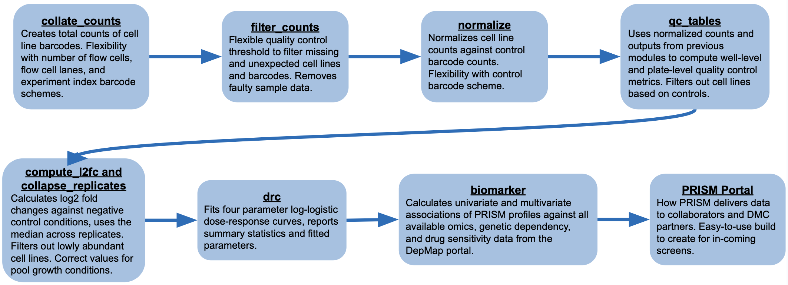
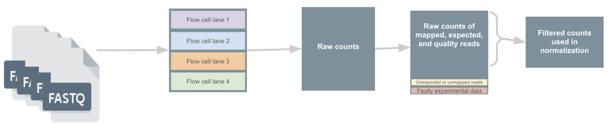

<style>
.toggle-button {
  float: right;
  font-size: 0.8em;
  margin-left: 10px;
  background: none;
  border: none;
  color: #007BFF;
  cursor: pointer;
}

.toggle-button:hover {
  text-decoration: underline;
}
</style>

<script>
document.addEventListener("DOMContentLoaded", function () {
  const headers = document.querySelectorAll("h1:not(.title)");

  headers.forEach(header => {
    const btn = document.createElement("button");
    btn.textContent = "[–]";
    btn.className = "toggle-button";
    header.appendChild(btn);

    const content = [];
    let el = header.nextElementSibling;

    while (el && !(el.tagName === "H1" && !el.classList.contains("title"))) {
      content.push(el);
      el = el.nextElementSibling;
    }

    btn.addEventListener("click", () => {
      const isVisible = content[0] && content[0].style.display !== "none";
      content.forEach(e => {
        if (e) e.style.display = isVisible ? "none" : "";
      });
      btn.textContent = isVisible ? "[+]" : "[–]";
    });
  });
});
</script>


```{r setup, include=FALSE}
knitr::opts_chunk$set(echo = FALSE, message = FALSE, warning = FALSE)

# ==============================
# TO DO: Please update both paths below before running this markdown!
# ==============================
# Path to local copy of the Sushi repository
local_sushi_path = "~/GitHub/cmap/sushi"
# Path to local copy of the vignette data
local_test_data_path = "~/Downloads/vignette_test_data"
# ==============================

# Check that the provided directories exist
if (!dir.exists(local_sushi_path)) {
  stop("Local sushi repo not found at ", local_sushi_path)
}

if (!dir.exists(local_test_data_path)) {
  stop("Local vignette data not found at ", local_sushi_path)
}
```

# Sushi pipeline overview
**Sushi** is the PRISM data processing pipeline that converts raw PRISM barcode counts, obtained from sequencing data, into normalized counts and log2 fold changes (L2FCs). A quick overview of the key parts of the pipeline is described below. First, in the **collate_counts** module, raw counts of PRISM barcodes from individual flow cells and flow cell lanes are aggregated appropriately. The **filter_counts** module maps each barcode to its corresponding cell line or control barcode identity and removes any spurious barcodes. The **normalize** module then normalizes raw cell line counts using spiked-in control barcodes to control for variability in PCR or DNA concentration. Next, **compute_l2fc** calculates L2FCs for each cell line in each treatment replicate. Treatment replicates are further collapsed in **collapse_replicates**, which computes L2FCs across replicates. The **qc_tables** module then performs quality control to flag low quality pcr wells or cell lines, with poorly performing wells being removed from the normalized counts file and unreliable cell lines being removed from the log fold change file. The **dose_response** module fits dose–response curves using cell line viability (2^L2FC) for each treatment, and uses this to compute AUC (Area Under Curve) values. Finally, univariate and multivariate associations between L2FC/AUCs values and DepMap feature data are performed in the **biomarker** module. The output files containing normalized counts, LFC, and collapsed LFC are partitioned by collaborator, then used for downstream dose-response and biomarker analysis.



# Getting started with Sushi
**Sushi** is the PRISM pipeline designed to process raw barcode counts from sequencing experiments. The sushi pipeline github repository can be found at <https://github.com/cmap/sushi/tree/main>
It follows a linear structure, with each step implemented as a separate module. Each module includes: (1) a Bash script to launch the module, (2) an R setup script containing the necessary parameters and inputs for the module, and (3) a core R script that defines the module’s function(s). All three scripts are contained in their corresponding folder under the `sushi/scripts/` directory. Common utility functions used across modules are defined in the `sushi/scripts/utils/` folder. This vignette is located in the `sushi/vignette/` folder.

This vignette uses data from screening encorafenib in an MTS format screen that can be downloaded https://assets.clue.io/vignette_test_data/vignette_test_data.zip

**Details about Sushi output files, including column definitions, can be found in the  accompanying spreadsheet: ** https://docs.google.com/spreadsheets/d/1A_9OlCjcTVJIhe1zwQjdcVyT9K3wrL4FMv0HwimZoW4/edit?usp=sharing

Sushi uses a few important groups of columns during data processing. It is helpful to be familiar with these columns to follow the data processing steps. These are:
`cell_line_cols`: columns used to identify a unique instance of a barcoded cell line. These are `depmap_id`, `lua`, `pool_id`, and `cell_set`;
`sig_cols`: columns used to describe each unique treatment condition at the collapsed LFC level (i.e., not including replicates);
`id_cols` columns identifying each unique PCR sample;
`control_cols` columns that help identify and group appropriate control wells for a given treatment.


# Data Processing

## From sequencing output to pre-normalized counts
This section describes steps taken to prepare PRISM sequencing data for normalization. **These steps are for internal processing only, and documentation is provided for completeness.**



To generate barcode counts from FASTQ files, we use an internal pipeline. It demultiplexes the data from different flow-cells  based on index barcodes which identify the PCR plate and PCR well of origin. The pipeline outputs counts of the barcodes detected in the experiment. These are then mapped to cell line and spike-in control barcodes. Alongside this process, internal PRISM databases are queried for experiment and cell line metadata.


To obtain the cumulative raw counts of each barcode detected in each sample across all flow cells and lanes, the **collate_counts** module (`sushi/scripts/collate_counts/collate_counts.R`) aggregates the counts. Barcodes are categorized as either recognized or unknown. A barcode is considered recognized if its sequence is associated with a cell line or control barcode in the PRISM collection.

Next, the **filter_counts** module (`sushi/scripts/filter_counts/filter_counts.R`) filters the count data to just barcodes that are supposed to have been present in the particular experimental condition. Barcodes associated with cell lines added to the condition, but not detected by the sequencer (likely due to strong killing) are imputed with a count of zero. Finally, the module removes any data flagged internally for reasons like dosing failure reported in instrument logs or cell line quality concerns based on STR profiling.


## Normalizing raw counts {.tabset}

### Description


To correct for amplification differences between wells, control barcodes at fixed concentrations are spiked into each PCR well. The raw counts of the control barcodes obtained from each well are linearly proportional to their input amount. The median of this proportionality factor is then used to scale raw counts in each well and obtain normalized counts in the **normalize** module (`sushi/scripts/normalize/normalize.R`). The CB_normalize module requires `filtered_counts.csv` and `CB_meta.csv` files as inputs. Although these files are not available to collaborators, the essential content used to normalize data is present in the normalized counts file shared to collaborators.


For each combination of PCR plate, PCR well, and control barcode dosage: the dose intercept (`dose_intercept`) is the difference between the known log2 dose of the control barcode and the mean log2 raw count. Then, for each PCR plate and PCR well, compute the control barcode intercept (`cb_intercept`) as the median of the dose intercepts across all control barcodes in that well. After normalization, a pseudovalue is added to avoid infinite values in log space. The exact pseudovalue is the normalized value for a read count of 10 using the fits of the negative controls of a PRC plate. The read count of 10 is the detection limit of the sequencers.

You may recreate the necessary input from your level 3 data or normalized and raw counts data download found on your PRISM Portal page and using the downloadable excel sheet to ensure necessary columns in your input files:

### Example

Here, we describe an example of how to test run module on your own data from the PRISM portal. Although `filtered_counts.csv` and `CB_meta.csv` are not provided, they can be made from the normalized data download and the data column definition spreadsheet as a reference. The `pseudocount` is a count we add to raw counts when taking the log2 transform. `input_id_cols` is a vector of column identifying unique samples.

```{r example normalization, echo = T, eval = T}
# Load into environment ----
require(magrittr)
require(tidyverse)
source(file.path(local_sushi_path, "scripts", "utils", "kitchen_utensils.R"))
source(file.path(local_sushi_path, "scripts", "normalize", "normalize_functions.R"))

# Set up inputs ----
filtered_counts <- read_data_table(file.path(local_test_data_path, "filtered_counts.csv"))
CB_meta <- read_data_table(file.path(local_test_data_path, "CB_meta.csv"))
pseudocount <- 0
input_id_cols <- c("pcr_plate", "pcr_well")
negcon_cols <- c("pcr_plate", "pert_vehicle")

# Normalize your counts ----
normalized_counts = normalize(X = filtered_counts, 
                              id_cols = input_id_cols,
                              CB_meta = CB_meta, 
                              pseudocount = pseudocount)

normalized_counts = add_pseudovalue(normalized_counts, negcon_cols,
                                    read_detection_limit = 10, negcon_type = "ctl_vehicle")

head(normalized_counts)
```

Example of raw counts-input dose relationship of the spiked-in control barcodes in a single PCR well is shown below:

```{r ex cb ladder, echo = T, eval = T}
# Load into environment ----
library(ggrepel)

# Plot control barcode ladder ----
normalized_counts %>% 
  dplyr::filter(!is.na(cb_name) & !is.na(cb_log2_dose)) %>%
  mutate(pcr_profile = paste0(pcr_plate,";", pcr_well)) %>%
  dplyr::group_by(pcr_profile) %>%
  filter(pcr_plate == "SEQ004_S1.X1.PR2025A") %>%
  filter(pcr_well == "A01") %>%
  distinct() %>%
  ggplot() + 
  aes(x = log2(n + pseudocount), y = cb_log2_dose, label = cb_name, color = as.factor(cb_log2_dose)) +
  geom_point() +
  geom_abline(aes(slope = 1, intercept = cb_intercept) , color = 'blue') +
  geom_text_repel(nudge_y = 0.2) +
  labs(x = 'log2(n)', y = 'log2(dose)') + 
  facet_wrap(pcr_profile~.) +
  theme_bw() + theme(text = element_text(size = 10))
```


## Filtering based on quality control {.tabset}

### General Description

**Although collaborators are not able to run this module due to its requirement of internal data, they are able to see how QC metrics are calculated through this code.**

At PRISM, we strive to deliver results with great quality and reliability from our screens. Through statistical explorations, our Analytics team has determined these quality control metrics and thresholds to improve the quality of screen results. Filtering cell lines and PCR wells starts with the **qc_tables module** (`sushi/scripts/qc_tables/qc_tables.R`).

### Measures of cell line quality

The following four metrics define cell line failure on a particular PCR plate. Note that the two metrics utilizing a positive control are only used if there are is a positive control in the experiment. The cell line may pass on other PCR plates containing treatment replicates. If only one replicate of the cell line passes across all PCR plates containing the cell line, then the cell is deemed to have failed at the pert plate (set of replicates that may be across PCR plate) level. Log2-viability data from passing cell lines are provided in downloads files. 

* The cell line is sufficiently abundant in the negative control condition (`nc_raw_counts_threshold`). In particular, a cell line needs to have a median raw count > 40 across negative control wells on the PCR plate

* Cell line variability (`nc_variability_threshold`) is low, i.e, the Median Absolute Deviation (MAD) of the log2-normalized counts of the cell line in negative control wells on the PCR plate is < a threshold determined based on the experimental design. For example, this threshold = 1 for MTS and APS screens and 1.5 for EPS since it has more replicates

* The cell line is killed sufficiently in positive control (`pc_viability_threshold`), i.e., the median cell line viability across positive control wells on the PCR plate < 0.25

* Cell line killing is detected reliably (`error_rate_threshold`), i.e., the overlap of cell line signal between negative and positive control conditions on the PCR plate is small. This is quantified by the error rate of the optimal single threshold classifier between the log2-normalized counts in negative and positive control wells for the cell line. The error rate is defined as:

$$
ER = \frac{FPR + FNR}{2}
$$

where $FPR$ is the false positive rate and $FNR$ is the false negative rate. Specifically, for each cell line in a replicate plate, we identify the threshold log2-normalized counts value that minimizes the sum of errors, defined as the fraction of positive control log2-normalized counts replicates exceeding the threshold and the fraction of negative control log2-normalized counts replicates falling below it, and report the corresponding error rate.

### Measures of well quality {.tabset}

The following three metrics define PCR well failure on a particular PCR plate. Passing wells have their data provided in normalized counts data.

* We filter out wells that do not have sufficient amplification, determined by a threshold on the median raw count of the control barcodes in the well (`well_reads_threshold`). (We do not have a threshold on reads from cell lines since a strong treatment may kill all the cells.)

* We filter out wells that may have been contaminated or had PCR issues, determined by a threshold on the fraction of reads in a well that are associated with cell lines and control barcodes expected to be present in the well (`contamination_threshold`)

* We filter out wells where there may have been control barcode contamination, estimated by the linearity of the relationship between control barcode count and dose using Spearman correlation (`cb_spearman_threshold`) and Mean Absolute Error (`cb_mae_threshold`) on a logarithmic scale.

## Calculating log2 fold changes {.tabset}

### Description

A PRISM screen may incorporate multiple types of replicates that is denoted as below:

* **Biological replicates** (`bio_rep`) represent independent extractions of the same cell lines, all subjected to identical experimental conditions.

* **Technical replicates** (`tech_rep`) are repeated PCR reactions of the same biological sample under the same treatment conditions. 

Sushi first computes log2 fold changes (L2FCs) across technical replicates and then collapses these values into a summary for each biological replicate. To quantify cell line growth and sensitivity to treatments, the **compute_l2fc** (`sushi/scripts/compute_l2fc/compute_l2fc.R`) first computes the mean normalized counts across technical replicates since there is less variability between technical replicates compared to biological replicates. Then, log2 fold change is computed by comparing these means to those of the negative control samples, using the formula:

$$
L2FC_{i,j} = log_2({x_{t_{i,j}}})-log_2({x_{nc_{i,j}}}) 
$$

where $i,j$ is cell line $i$ in a treatment condition $j$, $x_t$ is mean normalized counts across technical reps, and $x_{nc}$ is the mean normalized counts of negative control taken across technical replicates, and then median across their biological replicates.


If pool level growth annotations are provided, the computed L2FCs can be corrected to remove variance associated with different growth patterns, cell sets, and abundance in the negative controls.

### Example

Here is an example of how to run the compute_l2fc module on your own data. `control_type` is the string designating negative controls wells, `sig_cols` are the variables describing each unique treatment (not including replicates), `ctrl_cols` describes the columns used to match treatment and control samples, `count_col_name` is a string of the name of the log2 normalized count column, `count_threshold` is an integer threshold describing low raw cell line counts, and `cell_line_cols` is a vector of columns that designate a unique cell line.


```{r example l2fc, echo = T, eval = T}
# Load into environment ----
require(magrittr)
require(tidyverse)
source(file.path(local_sushi_path, "scripts", "utils", "kitchen_utensils.R"))
source(file.path(local_sushi_path, "scripts", "compute_l2fc", "compute_l2fc_functions.R"))

# Set up inputs ----
normalized_counts <- read_data_table(file.path(local_test_data_path, "normalized_counts.csv"))
control_type <- "ctl_vehicle"
sig_cols <- c("pert_name","pert_dose","pert_dose_unit","day")
ctrl_cols <- c("cell_set", "day", "pcr_plate", "replicate_plate")
count_col_name <- "log2_normalized_n"
cell_line_cols <- c("cell_set", "lua", "depmap_id", "pool_id", "growth_pattern")

# Calculated log2 fold changes
l2fc = compute_l2fc(normalized_counts = normalized_counts,
                    control_type = control_type,
                    sig_cols = sig_cols,
                    ctrl_cols = ctrl_cols,
                    count_col_name = count_col_name,
                    cell_line_col = cell_line_cols)

head(l2fc)
```

Cell lines that failed QC can be removed from the log fold-change files as described below:
```{r l2fc opt filt, echo = T, eval = F}
# CURRENTLY NOT AVAILABLE!
qc_data <- data.table::fread(file.path(local_test_data_path, "qc_table.csv"))

# remove cell lines that fail for an entire pert_plate
join_cols = intersect(cell_line_cols, colnames(qc_data))
failed_lines_pert_plate = qc_data %>% filter(qc_pass_pert_plate == FALSE) %>% dplyr::select(all_of(join_cols))

l2fc = l2fc %>% anti_join(failed_lines_pert_plate, by= join_cols)
```

To apply the growth correction, there must be a column in the data frame that describes the growth pattern of a cell line or pool and a column containing log2 normalized counts of the negative controls.

```{r example growth correct, echo = T, eval = T}
# Load into environment ----
source(file.path(local_sushi_path, "scripts", "bias_correction", "bias_correction_functions.R"))

# Set up inputs ----
bio_rep_id_cols = c(sig_cols, "bio_rep")
growth_pattern_col = "growth_pattern"

# Correct for growth conditions
corrected_l2fc = l2fc |>
  dplyr::mutate(negcon_log2_norm_n = log2(control_median_normalized_n)) |>
  dplyr::group_split(dplyr::across(tidyselect::all_of(bio_rep_id_cols))) |>
  lapply(apply_bias_correction, raw_l2fc_col = "l2fc", growth_pattern_col = growth_pattern_col) |>
  dplyr::bind_rows() |>
  dplyr::ungroup()

head(corrected_l2fc)
```

## Collapsing log2 fold changes across replicates {.tabset}

### Description
From L2FCs calculated in the previous module, **collapse_replicates** (`sushi/scripts/collapse_replicates.R`) uses L2FC and takes the median across biological replicates. This gives us one median L2FC per cell line in each treatment condition.


### Example

Here is an example of how to run the collapse_replicates module on your own data.

```{r example collapsed l2fc, echo = T, eval = T}
# Load into environment ----
require(magrittr)
require(tidyverse)
source(file.path(local_sushi_path, "scripts", "utils", "kitchen_utensils.R"))
source(file.path(local_sushi_path, "scripts", "collapse_replicates", "collapse_replicates_functions.R"))

# Set up inputs ----
l2fc <- read_data_table(file.path(local_test_data_path, "l2fc.csv"))
sig_cols <- c("cell_set","pert_name","pert_dose","pert_dose_unit","day")
cell_line_cols <- c("depmap_id", "lua", "pool_id")

# Collapsed l2fcs ----
collapsed_l2fc = collapse_bio_reps(l2fc = l2fc, 
                                  sig_cols = sig_cols, 
                                  cell_line_cols = cell_line_cols)

head(collapsed_l2fc)
```

## Splitting based on projects

Although Sushi processes the entire screen—including all submitted compounds—in a single batch up to producing log fold-changes, collaborators are granted access only to data for their specific compounds and the validation compound. The PRISM Portal supports this internally by generating separate pages for each compound, with access restricted to designated collaborators. This functionality is handled within a separate, private pipeline responsible for building and managing the PRISM Portal pages. Downstream analysis modules work on data after splitting.

# Downstream Analysis

## Dose response module {.tabset}

### General Description

The **drc** module (`sushi/scripts/drc/dose_reponse.R`) fits 4-parameter dose-response curves (DRCs) to the viability (fold-change with respect to DMSO) of each cell line in all replicates that pass QC. The four parameters are upper limit ($UL$), lower limit ($LL$), slope ($s$), and inflection point ($EC50$).
The equation for the curve is defined as:

$$
f(x) = UL + \frac{LL-UL}{1 + \left(\frac{x}{EC50}\right)^s}
$$

### Additional details

The fit is performed with the following restrictions:

* For single agent studies, We support the predicted viability to decrease with increasing dose by constraining the slope parameter ($s$ < 1e-5). For combination studies, we relax this slope constraint since the two agents could be antagonistic.

* For single agent studies, we constrain the upper limit of the fit to be between 0.8 and 1.01. For combination studies, this constraint is relaxed as the viability at the anchor dose can be lower, and the upper limit of the fit is between 0 and 1.

* We constrain the lower limit of the fit to be between 0 and 1.

* We cap viabilities at 1.5 before fitting.

Since the nonlinear optimization underlying the curve fit can return a local optimum, we first fit the data using a number of different optimization methods and initial conditions implemented in the `drc` and `dr4pl` packages, and then report the fit with the smallest mean squared error (MSE). The `dr4pl` package provides a robust fit in some scenarios where the naive fit fails to converge.

The Area Under Curve (AUC) values are computed for each dose-response curve by integrating the numerical fit. IC50 values are computed only for the curves where have data for more than 5 doses that drop below 50% viability. The Riemann AUC (AUCr) values are computed from the data points directly as the Riemann sum of the viabilities capped at 1:

$$
AUC_r = \frac{1}{n} \sum_{i=1}^{n}min(FC_i, 1) 
$$

where $FC_i$ is the fold change value, $i$ indexes the data point, and $n$ is the number of data points in the profile.
In scenarios where no fit converges, fit parameters for the cell line are not provided but the Riemann AUC is provided as it is independent of the fit.

### Example

Here is an example of how to run the dose_response module on your own data.`dose_cols` is a list of columns containing perturbagen doses, which is used to check that there is only one column with doses. `type_col` is a string designating which column denotes the type of treatment that each sample is, and `cap_of_viability` is the maximum value given to a cell line's viability.

The following example uses two cell, one with a BRAF mutation and one without, in the presense of Encorafenib.
```{r example drc, echo = T, eval = T}
# Load into environment ----
require(dr4pl)
require(drc)
require(magrittr)
require(tidyverse)
require(rlang)
source(file.path(local_sushi_path, "scripts", "utils", "kitchen_utensils.R"))
source(file.path(local_sushi_path, "scripts", "drc", "dose_response_functions.R"))

# Set up inputs ----
l2fc <- read_data_table(file.path(local_test_data_path, "l2fc.csv"))
cell_line_cols <- c("depmap_id", "lua", "pool_id")
sig_cols <- c("cell_set", "pert_name", "pert_dose", "pert_dose_unit", "day")
dose_col <- "pert_dose"
l2fc_column <- "l2fc"
type_col <- "pert_type"
cap_for_viability <- 1.5

# Create treatment_columns by removing column names containing "dose" ----
treatment_cols <- union(
  sig_cols[grepl("pert", sig_cols) & !grepl("dose", sig_cols)],
  sig_cols[sig_cols == "day"]
)

# FIT DRC curves ----

select_cell_lines <- c("ACH-000008", "ACH-000810")

dose_response <- create_drc_table(LFC = l2fc %>% filter(depmap_id %in% select_cell_lines),
                                  screen_type = "MTS_SEQ",
                                cell_line_cols = cell_line_cols,
                                treatment_cols = treatment_cols,
                                dose_col = dose_col,
                                l2fc_col = l2fc_column,
                                type_col = type_col,
                                cap_for_viability = cap_for_viability)

head(dose_response)
```

If a warning message occurs similar to

`Error in optim(startVec, opfct, hessian = TRUE, method = "L-BFGS-B", `
`lower = lowerLimits,  : L-BFGS-B needs finite values of 'fn'`

it indicates issues relating to some initializations in the optimization of the fit, but it does not mean that the fit failed. 

Here is an example of a dose response curves
```{r drc plot, echo = T, eval = T}

dose_response %<>% mutate(line_annot = ifelse(depmap_id == "ACH-000008", 
                                              "ACH-000008 - BRAF mut", "ACH-000810 - no BRAF mut"))

# Helper: generate allowed 3-fold doses ≤ 1
get_doses_up_to_one <- function(min_dose) {
  # Calculate max exponent such that min_dose * 3^n <= 1
  max_exp <- floor(log(1 / min_dose) / log(3))
  min_dose * 3^(0:max_exp)
}

# Smooth dose-response per cell line (more points for curve)
smooth_df <- dose_response %>%
  rowwise() %>%
  do({
    min_dose <- .$minimum_dose
    max_dose <- 1
    doses_smooth <- 10^seq(log10(min_dose), log10(max_dose), length.out = 100)
    tibble(
      depmap_id = .$depmap_id,
      line_annot = .$line_annot,
      doses = doses_smooth,
      response = .$upper_limit + ((.$lower_limit - .$upper_limit) / (1 + (doses_smooth / .$inflection)^.$slope)),
      ec50 = .$inflection
    )
  }) %>%
  ungroup()

# 3-fold doses per cell line, capped at 1 — for points & x-axis breaks
l2fc %<>%
  filter(depmap_id %in% select_cell_lines) %>%
  mutate(viability = pmin(2^l2fc, cap_for_viability)) %>%
  group_by(!!!rlang::syms(c(sig_cols, "bio_rep", "depmap_id", "lua", "pool_id"))) %>%
  summarise(viability = median(viability)) %>%
  ungroup() %>%
  mutate(line_annot = ifelse(depmap_id == "ACH-000008", 
                                              "ACH-000008 - BRAF mut", "ACH-000810 - no BRAF mut"))

# Unique sorted tick locations for x-axis
x_axis_breaks <- sort(unique(round(l2fc$pert_dose, 6)))

# Plotting
drc_plot <- ggplot() +
  geom_line(data = smooth_df, aes(x = doses, y = response, color = line_annot)) +
  geom_point(data = l2fc, aes(x = pert_dose, y = viability, color = line_annot, group = depmap_id), alpha = 0.6) +
  scale_x_log10(breaks = x_axis_breaks) +
  geom_vline(data = dose_response, aes(xintercept = inflection, color = line_annot), linetype = "dashed") +
  coord_cartesian(ylim = c(0, 1.5))
  labs(title = "Dose-Response Curves of a BRAF mutant and WT",
       x = "Doses",
       y = "Response",
       color = "Cell line annotation") +
  theme_minimal()

print(drc_plot)
```

### Lineage enrichment boxplots

Using more cell lines from the dose-response results in conjunction with the lineage information in the available h5 file (more information in the biomarker section), you can recreate the lineage enrichment boxplots seen on the PRISM portla by plotting lineages and the cell line's AUC.

```{r example univariate lineage boxplots, echo = T, eval = T}
drc_table = read_data_table(file.path(local_test_data_path, "drc_table.csv"))
depmap_file_path <- file.path(local_test_data_path, "prism_biomarker_public_0625.h5")

lineages <- rhdf5::h5read(depmap_file_path, name = "Lineage_Table/table")
# Strip hdf5 columns of dimensionality before use
lineages[] <- lapply(lineages, as.vector)
drc_table %<>% dplyr::inner_join(lineages, by = "depmap_id")

drc_table %>%
  ggplot(aes(x = lineage, y = auc, fill = lineage, color = lineage)) +
  geom_boxplot(alpha = 0.4) +
  geom_point(alpha = 0.5) +
  theme_minimal() +
  theme(legend.position = "none") +
  theme(axis.text.x = element_text(angle = 90, vjust = 0.5, hjust = 1))+
  labs(title = "Skin lines are more susceptible to Encorafenib", x = "Lineage")
```


## Identifying biomarkers

### Univariate biomarker analysis {.tabset}

#### Description

For univariate biomarker analysis with continuous features (e.g. CRISPR dependency, gene expression, etc.), we calculate the Pearson correlation and corresponding p-values. For univariate biomarker analysis with discrete features (e.g. mutations, lineage, etc.), we calculate the effect size as the regression coefficient against the binary feature and provide corresponding p-values. (The regression coefficient equals the difference in means of the two groups.) Multiple hypothesis correction is computed using the Benjamini-Hochberg procedure to provide q-values

#### Example

Here is an example of how to run the univariate biomarker function on your data. `depmap_file_path` is a path to the h5 file of public release omics data from DepMap, which can be found for download on the PRISM portal. The h5 file (found in the S3 download) is made by selecting omics datasets from the DepMap public release.

```{r example univariate biomarker, echo = T, eval = T}
# Load into environment ----
require(data.table)
require(magrittr)
require(tidyverse)
require(rhdf5)
require(WGCNA)
require(rlang)
require(matrixStats)
source(file.path(local_sushi_path, "scripts", "utils", "kitchen_utensils.R"))
source(file.path(local_sushi_path, "scripts", "biomarker", "biomarker_functions.R"))

# Set up inputs ----
depmap_file_path <- file.path(local_test_data_path, "prism_biomarker_public_0625.h5")
collapsed_l2fc <- read_data_table(file.path(local_test_data_path, "collapsed_l2fc.csv"))
cell_line_cols <- c("depmap_id","lua","pool_id")
sig_cols <- c("cell_set","pert_name","pert_dose","pert_dose_unit","day")

# See all features 
all_features <-  substr(setdiff(rhdf5::h5ls(depmap_file_path)$group, "/"), 2, 100)
print(all_features)
select_features <- c("Expression", "Lineage", "CRISPR", "Mutation") # if NULL, selects all feature sets

# Cast the responses into a matrix
collapsed_l2fc_column <- "median_l2fc"
trt_cols_lfc = unique(c("day", sig_cols[grepl("pert", sig_cols)]))

transform_function <- function(x){x}

input_matrix <- collapsed_l2fc %>%
  dplyr::filter(is.finite(.data[[collapsed_l2fc_column]])) %>%
  tidyr::unite(cn, trt_cols_lfc, sep = "::") %>%
  reshape2::acast(depmap_id ~ cn, value.var = collapsed_l2fc_column, fun.aggregate = median) %>%
  transform_function()

# Calculate biomarkers ----
collapsed_l2fc_column <- "median_l2fc"
trt_cols_lfc <- unique(c("day", sig_cols[grepl("pert", sig_cols)]))
biomarkers <- univariate_biomarker_table(
  Y = input_matrix,
  file = depmap_file_path,
  features = select_features)

biomarkers %>% arrange(q_val) %>% head()
```

##### Biomarker volcano plots
```{r univar volcano plot, echo = T, eval = T}
require(ggrepel)

biomarkers %<>% 
  separate(y, into = trt_cols_lfc, sep = "::") %>% # separate labels
  filter(pert_dose %in% sort(unique(.$pert_dose), decreasing = TRUE)[1:5]) # subset for clarity

# Expression, CRISPR, and mutation volcano plots ----
for(dataset in c("Expression", "CRISPR", "Mutation")) {
  
  # assigns proper x axis for feature sets
  if(dataset %in% c("Expression", "CRISPR")){
    x = "correlation_coef"
  }else if(dataset == "Mutation"){
    x = "regression_coef"
  }
  
  # Get top 10 hits ----
  top_hits <- biomarkers %>%
    filter(feature_set == dataset) %>%
    arrange(q_val) %>%
    slice_head(n = 10)
  
  biomarkers_subset <- biomarkers %>%
    filter(feature_set == dataset) %>%
    mutate(is_top_hit = ifelse(feature %in% top_hits$feature, "Top 10 Hit", "Other"))
  
  # Create volcano plot ----
  plot <- biomarkers_subset %>%
    ggplot() +
    aes(x = !!rlang::sym(x), y = -log(q_val), color = is_top_hit) +
    geom_point(size = 1, alpha = 0.4) +
    facet_grid(~pert_dose,) +  
    geom_text_repel(data = filter(biomarkers_subset, is_top_hit == "Top 10 Hit"),
                    aes(label = feature),
                    size = 3,
                    max.overlaps = Inf) +
    scale_color_manual(values = c("Top 10 Hit" = "tomato1", "Other" = "cornflowerblue")) +
    theme_minimal() +
    theme(legend.position = "bottom") +
    labs(title = paste0("Encorafenib Biomarkers using ", dataset," Data Across Doses"))
  
  print(plot)
}
```

##### If you have AUCs, here is an example of how to calculate univariate biomarkers using them.
```{r example univariate biomarker with aucs, echo = T, eval = T}
# Biomarkers using AUC from DRC output ----
drc_table <- read_data_table(file.path(local_test_data_path, "drc_table.csv"))
dr_column <- "auc"

trt_cols_auc <- unique(c("day", sig_cols[grepl("pert", sig_cols) & !grepl("dose", sig_cols)]))

input_matrix_auc <- drc_table %>%
  dplyr::filter(is.finite(.data[[dr_column]])) %>%
  tidyr::unite(cn, trt_cols_auc, sep = "::") %>%
  reshape2::acast(depmap_id ~ cn, value.var = dr_column, fun.aggregate = median)

biomarkers_auc <- univariate_biomarker_table(
  Y = input_matrix_auc,
  file = depmap_file_path,
  features = select_features)

biomarkers_auc %>% arrange(q_val) %>% head()
```


### Multivariate biomarker analysis {.tabset}

#### Description

For each log2 viability at each dose (including $log_2AUC$), multivariate models are trained and fit using the molecular characterizations and genetic dependencies of the PRISM cell lines. The resulting importance of various features can be used to suggest potential biomarkers of compound response or to inform potential hypotheses for mechanisms of action. The dose or curve-level statistic used is noted in the “Dose” column.

Random forest models are trained using:
CCLE model: Cancer Cell Line Encyclopedia (CCLE) features (copy number alterations, RNA expression, mutation status and lineage annotation)
Complete model: Cancer Cell Line Encyclopedia (CCLE) features + reverse phase protein array data (RPPA) + CRISPR + miRNA + metabolomics (MET).
For each feature of each model, feature importance is computed after normalization (the sum of the importances is set to 1 in each model) and tabulated along with the accuracy measures. High variable importance and high accuracy for a given feature suggests that it is important for predicting sensitivity (at the given dose modeled). The feature importances are not directional quantities. 

#### Example

Here is an example of how to run the multivariate biomarker function on your data. Inputs are the similar to those for the univariate biomarker function. `W` is confounder matrix. It should not contain and NAs, rows are indexed by depmap_ids and aligned with Y. Its default is NULL. `k` is the number of cross validation fold, and its default is 10.

```{r example multivariate biomarker, echo = T, eval = T}
# Load into environment ----
require(data.table)
require(magrittr)
require(tidyverse)
require(rhdf5)
require(WGCNA)
require(rlang)
require(matrixStats)
source(file.path(local_sushi_path, "scripts", "utils", "kitchen_utensils.R"))
source(file.path(local_sushi_path, "scripts", "biomarker", "biomarker_functions.R"))

# Set up inputs ----
depmap_file_path <- file.path(local_test_data_path, "prism_biomarker_public_0625.h5")
collapsed_l2fc <- read_data_table(file.path(local_test_data_path, "collapsed_l2fc.csv"))
cell_line_cols <- c("depmap_id", "lua", "pool_id")
sig_cols <- c("cell_set", "pert_name", "pert_dose", "pert_dose_unit", "day")
W = NULL # confounding matrix
k = 10 # number of cross validation folds

# Cast the responses into a matrix
collapsed_l2fc_column <- "median_l2fc"
trt_cols_lfc = unique(c("day", sig_cols[grepl("pert", sig_cols)]))

transform_function <- function(x){x}

input_matrix <- collapsed_l2fc %>%
  dplyr::filter(is.finite(.data[[collapsed_l2fc_column]])) %>%
  tidyr::unite(cn, trt_cols_lfc, sep = "::") %>%
  reshape2::acast(depmap_id ~ cn, value.var = collapsed_l2fc_column, fun.aggregate = median) %>%
  transform_function()

# Calculate biomarkers ----
biomarkers <- multivariate_biomarker_table(
  Y = input_matrix,
  W = W,
  file = depmap_file_path,
  k = k
)

biomarkers %>% arrange(., -RF.imp.mean) %>% head()
```

##### Here is an example of how to calculate multivariate biomarkers with AUCs

```{r example multivariate biomarker with aucs, echo = T, eval = T}
drc_table <- read_data_table(file.path(local_test_data_path, "drc_table.csv"))
dr_column <- "log2_auc"

trt_cols_auc <- unique(c("day", sig_cols[grepl("pert", sig_cols) & !grepl("dose", sig_cols)]))

input_matrix_auc <- drc_table %>%
  dplyr::filter(is.finite(.data[[dr_column]])) %>%
  tidyr::unite(cn, trt_cols_auc, sep = "::") %>%
  reshape2::acast(depmap_id ~ cn, value.var = dr_column, fun.aggregate = median) %>%
  transform_function()


biomarkers_auc <- multivariate_biomarker_table(
  Y = input_matrix_auc,
  W = W,
  file = depmap_file_path,
  k = k
)

#most significant biomarkers correlated with AUC
biomarkers_auc %>% arrange(., -RF.imp.mean) %>% head()
```

# R environment information

```{r sessionInfo, echo = F, eval = T}
#utils:::print.sessionInfo(sessionInfo()[c(-10)])

si <- sessionInfo()

# Combine attached and loaded-only packages
all_pkgs <- c(si$otherPkgs, si$loadedOnly)

# Extract package names and versions
pkg_versions <- sapply(all_pkgs, function(pkg) pkg$Version)

# Sort alphabetically by package name
pkg_versions_sorted <- pkg_versions[order(names(pkg_versions))]

# Print result
cat("All packages used (attached + loaded via namespace):\n")
for (pkg in names(pkg_versions_sorted)) {
  cat(sprintf("  %s: %s\n", pkg, pkg_versions_sorted[pkg]))
}
```


